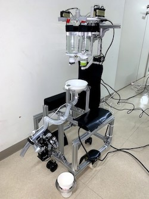

# Drink Server Robot



## 動作環境

+ Ubuntu Desktop 16.04 LTS 64bit
+ ROS Kinetic
+ Dynamixel Library Ver.4.3

## セットアップ

### ハードウェア

1. 直流安定化電源とロボット上部の基盤の＋とーを接続します（ダイナミクセルと基盤のコネクタも接続しておく）

2. 直流安定化電源を<b>11V</b>で起動します

3. PCに以下の3つを接続します
	+ Intel RealSense Depth Camera D435i
	+ ロボット上部の基盤
	+ マニピュレータ

### ソフトウェア

#### Dynamixel Libraryのインストール

1. Dynamixelと通信するためのライブラリを[ここ](http://www.besttechnology.co.jp/download/DXLIB_V4.3.zip)からダウンロードします

2. ダウンロードしたzipファイルを`drink_server_sh`ディレクトリに入れます

3. `drink_server_sh`に移動します

	```
	$ cd drink_server_sh
	```

4. 以下のコマンドを実行します

	```
	$ sh dxlib.sh
	```

5. `drink_server_hw/include`ディレクトリ に`dxlib.h`と`dxlib.o`が追加されていれば成功です

### 使用方法

1. makeします

	```
	$ cd ~/catkin_ws
	$ catkin_make
	```

2. デバイスファイルに実行権限を与えます
	
	```
	$ rosrun drink_server_control dev_file_setup.sh
	```
	
3. 以下のコマンドを実行します
	
	```
	$ roslaunch drink_server_control robot_prepare.launch
	$ roslaunch drink_server_control drink_robot_start.launch
	```
	
## 飲み物の交換方法

以下のコマンドを実行します。

```
$ rosrun drink_server_control drink_change.py
```

そうすると以下のようにターミナルに表示されます

```
a: All Open, r: Right Close, l: Left Close, q: Quit > 
```

* `a`を選択すると、上のストッパーが両方とも開きます
* `r`を選択すると、左のストッパーが閉じます
* `l`を選択すると、左のストッパーが閉じます
* `q`を選択すると、このプログラムを終了します